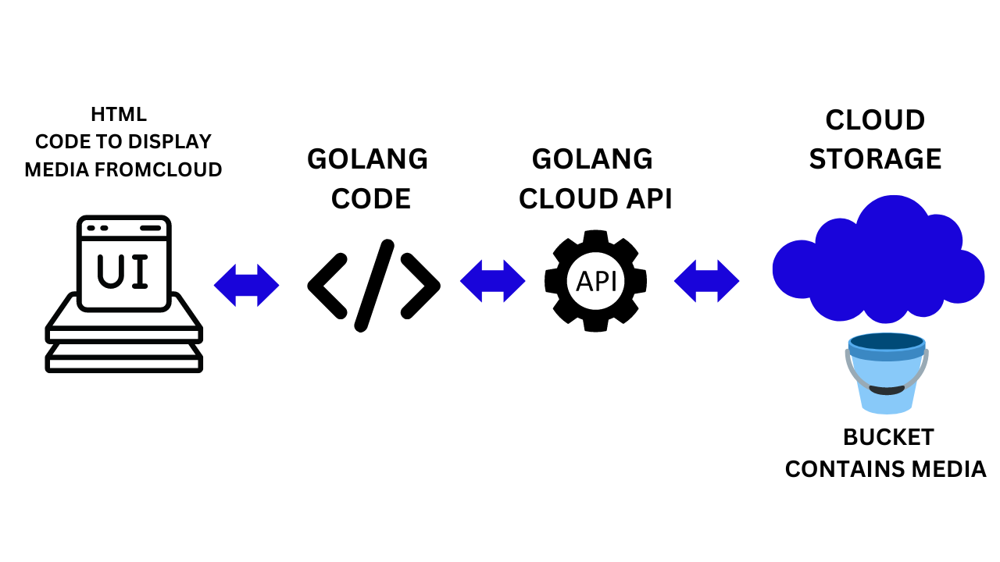

# IBM Cloud Object Storage - Go SDK

This package allows Go developers to write software that interacts with [IBM
Cloud Object Storage](https://www.ibm.com/cloud/object-storage).  It is a fork of the [``AWS SDK for Go``](https://github.com/aws/aws-sdk-go) library and can stand as a drop-in replacement if the application needs to connect to object storage using an S3-like API and does not make use of other AWS services.

## Notice

IBM has added a [Language Support Policy](#language-support-policy). Language versions will be deprecated on the published schedule without additional notice.

## Documentation

* [Core documentation for IBM COS](https://cloud.ibm.com/docs/services/cloud-object-storage?topic=cloud-object-storage-getting-started)
* [Go API reference documentation](https://ibm.github.io/ibm-cos-sdk-go)
* [REST API reference documentation](https://cloud.ibm.com/docs/services/cloud-object-storage?topic=cloud-object-storage-compatibility-api)

For release notes, see the [CHANGELOG](CHANGELOG.md).

* [Getting the SDK](#getting-the-sdk)
* [Example code](#example-code)
* [Getting help](#getting-help)

## Quick start

You'll need:

* An instance of COS.
* An API key from [IBM Cloud Identity and Access Management](https://cloud.ibm.com/docs/iam?topic=iam-userroles#userroles) with at least `Writer` permissions.
* The ID of the instance of COS that you are working with.
* Token acquisition endpoint
* Service endpoint

These values can be found in the IBM Cloud Console by [generating a 'service credential'](https://cloud.ibm.com/docs/services/cloud-object-storage/iam?topic=cloud-object-storage-service-credentials#service-credentials).

## Archive Tier Support

You can automatically archive objects after a specified length of time or after a specified date. Once archived, a temporary copy of an object can be restored for access as needed. Restore time may take up to 15 hours.

An archive policy is set at the bucket level by calling the ``PutBucketLifecycleConfiguration`` method on a client instance. A newly added or modified archive policy applies to new objects uploaded and does not affect existing objects. For more detail, see the [documentation](https://cloud.ibm.com/docs/services/cloud-object-storage?topic=cloud-object-storage-go).

## Immutable Object Storage

Users can configure buckets with an Immutable Object Storage policy to prevent objects from being modified or deleted for a defined period of time. The retention period can be specified on a per-object basis, or objects can inherit a default retention period set on the bucket. It is also possible to set open-ended and permanent retention periods. Immutable Object Storage meets the rules set forth by the SEC governing record retention, and IBM Cloud administrators are unable to bypass these restrictions. For more detail, see the [IBM Cloud documentation](https://cloud.ibm.com/docs/services/cloud-object-storage?topic=cloud-object-storage-go).

Note: Immutable Object Storage does not support Aspera transfers via the SDK to upload objects or directories at this stage.

## Accelerated Archive

Users can set an archive rule that would allow data restore from an archive in 2 hours or 12 hours.

## Getting the SDK

Use go build to add the SDK to your project's Go module dependencies.  The SDK requires a minimum version of Go 1.12.

```sh
go build ./...
```

## Example code

Create a file `main.go`, replacing your own values for API key, instance ID, and bucket name:

```go
package main
// (Import the required packages)
import (
 "fmt"

 "github.com/IBM/ibm-cos-sdk-go/aws"
 "github.com/IBM/ibm-cos-sdk-go/aws/credentials/ibmiam"
 "github.com/IBM/ibm-cos-sdk-go/aws/session"
 "github.com/IBM/ibm-cos-sdk-go/service/s3"
)

const (
 apiKey            = "<API_KEY>"
 serviceInstanceID = "<RESOURCE_INSTANCE_ID>"
 authEndpoint      = "https://iam.cloud.ibm.com/identity/token"
 serviceEndpoint   = "https://s3-api.us-geo.objectstorage.softlayer.net"
)

func main() {

 newBucket := "new-bucketee"
 newColdBucket := "new-cold-bucketee"

// load the aws config required to connect with IBM cloud
 conf := aws.NewConfig().
  WithEndpoint(serviceEndpoint).
  WithCredentials(ibmiam.NewStaticCredentials(aws.NewConfig(),
   authEndpoint, apiKey, serviceInstanceID)).
  WithS3ForcePathStyle(true)

 sess := session.Must(session.NewSession())
 client := s3.New(sess, conf)

 input := &s3.CreateBucketInput{
  Bucket: aws.String(newBucket),
 }
 client.CreateBucket(input)

 input2 := &s3.CreateBucketInput{
  Bucket: aws.String(newColdBucket),
  CreateBucketConfiguration: &s3.CreateBucketConfiguration{
   LocationConstraint: aws.String("us-cold"),
  },
 }
 client.CreateBucket(input2)

 d, _ := client.ListBuckets(&s3.ListBucketsInput{})
 fmt.Println(d)
}
```

From the command line, run `go run main.go`.  You should see a list of your buckets.

## Getting Help

Feel free to use GitHub issues for tracking bugs and feature requests, but for help please use one of the following resources:

* Read a quick start guide in [IBM Cloud Docs](https://cloud.ibm.com/docs/services/cloud-object-storage?topic=cloud-object-storage-go).
* Ask a question on [Stack Overflow](https://stackoverflow.com/questions/tagged/object-storage+ibm) and tag it with `ibm` and `object-storage`.
* Open a support ticket with [IBM Cloud Support](https://cloud.ibm.com/unifiedsupport/supportcenter/)
* If it turns out that you may have found a bug, please [open an issue](https://github.com/ibm/ibm-cos-sdk-go/issues/new).

## Language Support Policy

IBM supports [current public releases](https://golang.org/doc/devel/release.html). IBM will deprecate language versions 90 days after a version reaches end-of-life. All clients will need to upgrade to a supported version before the end of the grace period.

## License

This SDK is distributed under the
[Apache License, Version 2.0](http://www.apache.org/licenses/LICENSE-2.0),
see LICENSE.txt and NOTICE.txt for more information.

## High Level Design 


